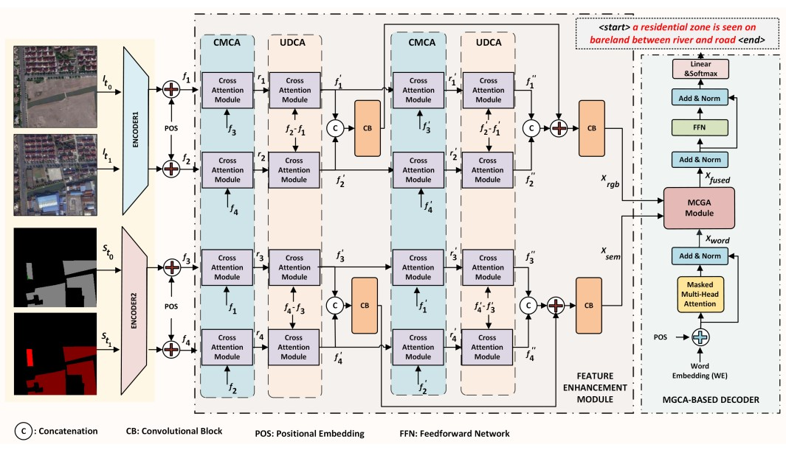

# Robust Change Captioning in Remote Sensing: SECOND-CC Dataset and MModalCC Framework

📢 **This paper is published in IEEE Journal of Selected Topics in Applied Earth Observations and Remote Sensing (JSTARS), 2025.**  
🔗 [IEEE Xplore Link](https://ieeexplore.ieee.org/stamp/stamp.jsp?tp=&arnumber=11130644)  
📄 DOI: [10.1109/JSTARS.2025.3600613](https://doi.org/10.1109/JSTARS.2025.3600613) \
\
🌐 [**MOSAIC Research Group Website**](https://avesis.yildiz.edu.tr/arastirma-grubu/mosaic)

## 🔎 Summary
Existing remote sensing change captioning (RSICC) methods struggle under illumination differences, viewpoint changes, blur, resolution mismatch, and registration errors, often leading to inaccurate captions in no-change regions. To overcome these challenges, we introduce **SECOND-CC**, a new dataset with **6,041 bitemporal image pairs** and **30,205 human-annotated sentences**, enriched with semantic segmentation maps and diverse real-world scenarios. We further propose **MModalCC**, a multimodal framework that fuses semantic and visual data via **Cross-Modal Cross Attention** and **Multimodal Gated Cross Attention**

---

<p align="center">
  
</p>

[]()
[]()
[](https://doi.org/10.1109/JSTARS.2025.3600613)
---

⭐ **Share us a star if this repo helps your research!**  

🔥 Our new work on **change captioning and multimodal reasoning** is continuously updated here. Stay tuned! 🔥

---

## 📘 SECOND-CC Dataset
We introduce **SECOND-CC**, a large-scale remote sensing change captioning dataset.

- [Download Link (Google Drive)](https://drive.google.com/file/d/1tzL9l6rEXevFyjjMVOfhrUe74o0Dk5qs/view?usp=sharing)
- [Download Link (Zenodo, DOI: 10.5281/zenodo.16937571)](https://doi.org/10.5281/zenodo.16937571)
- Train / Val / Test splits provided with RGB and Semantic Maps
- Includes paired images + change captions  

Example pair:  

<p align="center">
  
</p>

---

## ⚙️ Installation and Dependencies
```bash
git clone https://github.com/MOSAIC-Lab/MModalCC.git
cd MModalCC
conda create -n mmodalcc_env python=3.6
conda activate mmodalcc_env
pip install -r requirements.txt
```

---

## 📊 Evaluation Metrics

For evaluation, we use standard captioning metrics: **BLEU, CIDEr, ROUGE-L, METEOR, and SPICE**.

Due to GitHub storage limitations, the `eval_func/meteor` and `eval_func/spice` subfolders are **not included** in this repository.  
You can download them from Google Drive:

- [METEOR & SPICE Evaluation Scripts (Google Drive)](https://drive.google.com/file/d/1GseNGhs2qhIW6G72fktrWckbTaZ98vws/view?usp=sharing)

After downloading, place them under:
```bash
./eval_func/
├── bleu/
├── cider/
├── rouge/
├── meteor/
└── spice/
```

---

## 📂 Data Preparation

### 1. Download the Dataset
Download **SECOND-CC** dataset from Google Drive:

- [SECOND-CC Dataset (Google Drive)](https://drive.google.com/file/d/1tzL9l6rEXevFyjjMVOfhrUe74o0Dk5qs/view?usp=sharing)
- [SECOND-CC Dataset (Zenodo, DOI: 10.5281/zenodo.16937571)](https://doi.org/10.5281/zenodo.16937571)
  
Place the dataset under:
./SECOND_CC_dataset/

The directory structure should look like:
```
SECOND_CC_dataset/
├── train/
├── val/
├── test/
└── SECOND-CC-AUG.json
```
---

### 2. Preprocess Dataset and Generate HDF5 Files
To convert raw data into HDF5 feature files, run:
```bash
python createHD5files.py --min_word_freq 10 
```

After preprocessing, you will find the generated files in:
./createdFileBlackAUG/

### 3. Use Preprocessed HDF5 Files (Optional)
We also provide ready-to-use .h5 files:

SECOND-CC HDF5 Files ([Google Drive](https://drive.google.com/file/d/1fSuzIKREf5-Df442bn0ym4duZI2zF389/view?usp=sharing))

Download and extract them into:

./createdFileBlackAUG/

---

## 🔎 Inference Demo

You can download our pretrained model checkpoint: [Google Drive](https://drive.google.com/file/d/1VYGYn9UbdCRnVJrpOWZAx-WRXHZwzW4C/view?usp=sharing)

After downloading, put it into:

./checkpoint/

Run demo:
```bash
python eval_MModalCC.py --beam_size 4 --data_folder .\createdFileBlackAUG --path .\checkpoint
```
Generated captions will be saved in the workspace as well as ground truth captions.

---

## 🏋️ Training

Make sure dataset preprocessing is done. Then run:

Run training:
```bash
python train_MModalCC.py
  --data_folder ./createdFileBlackAUG/ \
  --data_name SECOND_CC_5_cap_per_img_10_min_word_freq \
  --encoder_image resnet101 \
  --epochs 30 \
  --batch_size 28 \
  --encoder_lr 5e-5 \
  --decoder_lr 5e-5 \
  --fine_tune_encoder True

```

---

## 📑 Citation

If you find our work useful, please cite:
```bash
@article{karaca2025robust,
  title   = {Robust Change Captioning in Remote Sensing: SECOND-CC Dataset and MModalCC Framework},
  author  = {Karaca, Ali Can and Serttaş, Oğuzhan and Duman, Eren and Özelbaş, Enes and Karimli, Orkhan and Amasyalı, Mehmet Fatih and Diri, Banu and Bilgin, Gökhan},
  journal = {IEEE Journal of Selected Topics in Applied Earth Observations and Remote Sensing},
  year    = {2025},
  volume  = {XX},
  number  = {XX},
  pages   = {1--14},
  doi     = {10.1109/JSTARS.2025.XXXXXXX}
}
```

---

## 🙏 Reference

We thank the following repositories:

- [a-PyTorch-Tutorial-to-Image-Captioning](https://github.com/sgrvinod/a-PyTorch-Tutorial-to-Image-Captioning)

- [RSICCformer (Liu et al., TGRS 2022)](https://github.com/Chen-Yang-Liu/RSICC)
