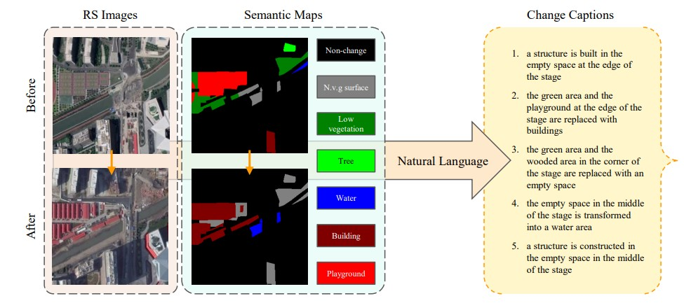

# Robust Change Captioning in Remote Sensing: SECOND-CC Dataset and MModalCC Framework

📢 **This paper is published in IEEE Journal of Selected Topics in Applied Earth Observations and Remote Sensing (JSTARS), 2025.**  
🔗 [IEEE Xplore Link](https://ieeexplore.ieee.org/stamp/stamp.jsp?tp=&arnumber=11130644)  
📄 DOI: [10.1109/JSTARS.2025.3600613](https://doi.org/10.1109/JSTARS.2025.3600613)

  

---

⭐ **Share us a star if this repo helps your research!**  

🔥 Our new work on **change captioning and multimodal reasoning** is continuously updated here. Stay tuned! 🔥

---

## 📘 SECOND-CC Dataset
We introduce **SECOND-CC**, a large-scale remote sensing change captioning dataset.

- [Download Link (Google Drive)](https://drive.google.com/...)  
- Train / Val / Test splits provided  
- Includes paired images + change captions  

Example pair:  

  

---

## 🏗️ MModalCC Framework
Here, we provide the PyTorch implementation of our paper:

**Robust Change Captioning in Remote Sensing: SECOND-CC Dataset and MModalCC Framework**  
_Accepted by IEEE JSTARS, 2025_

---
